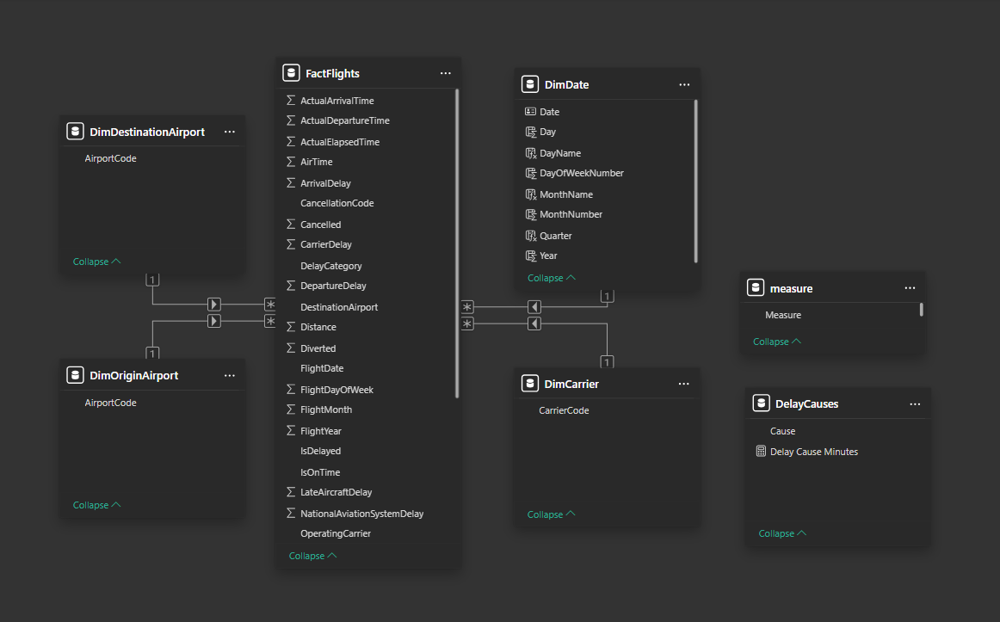
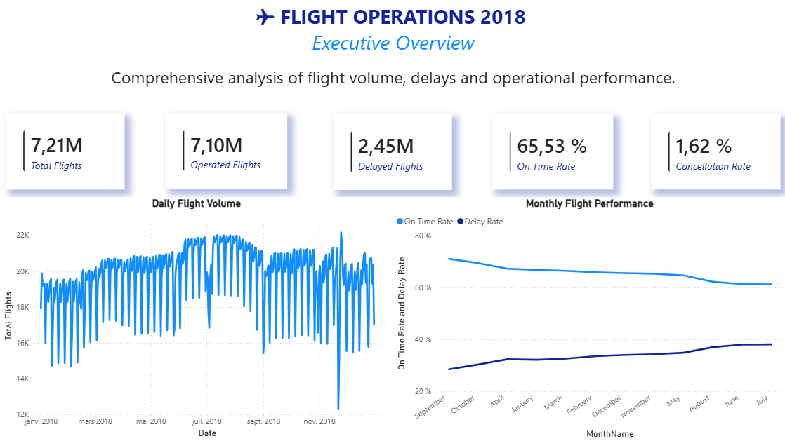
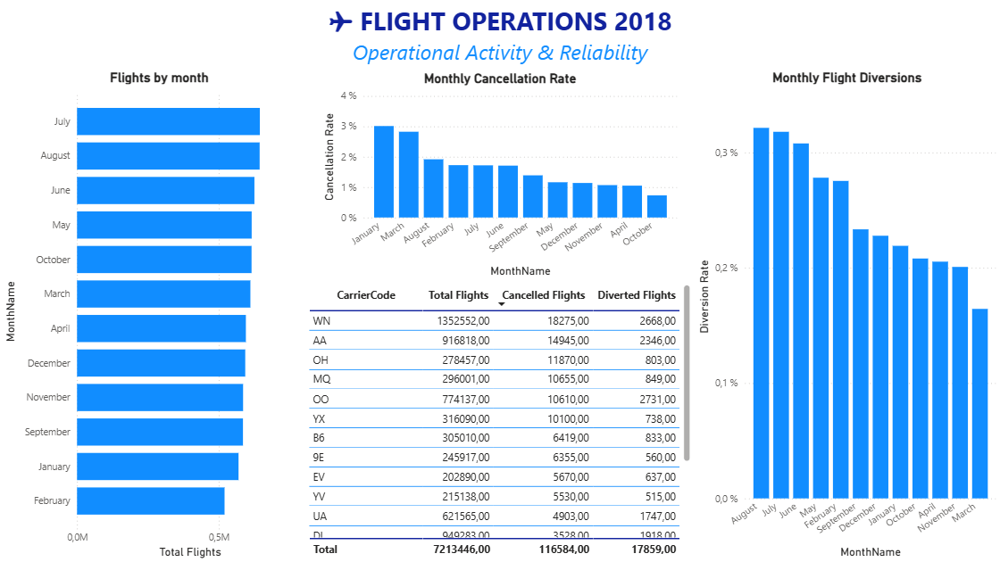
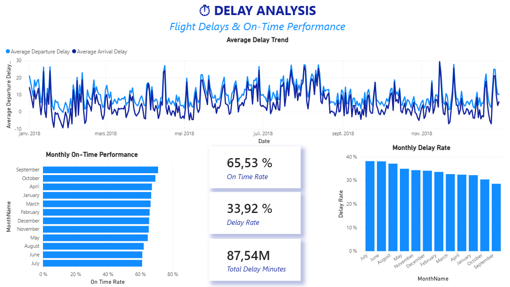
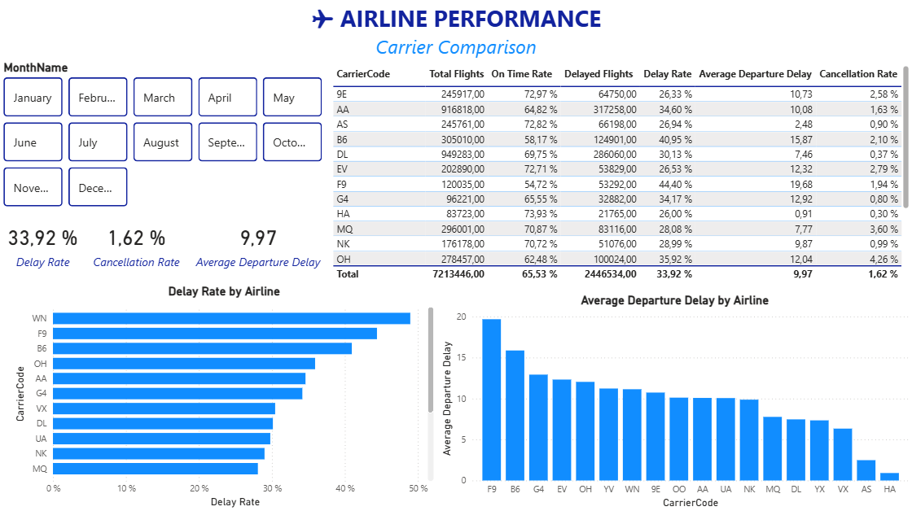
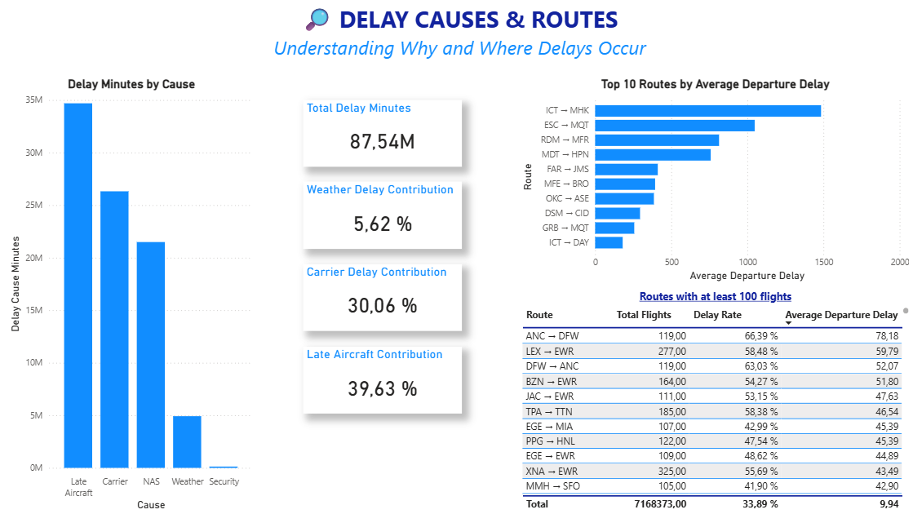

# ✈️ Flight Operations & Delay Analysis — 2018

> An end-to-end Business Intelligence project developed with Power BI, Power Query, and DAX to analyze flight operations, delays, cancellations, diversions, airlines, routes, and delay causes across 2018.

---

## 📌 Project Overview

This project transforms raw 2018 flight records into an interactive Business Intelligence dashboard using Microsoft Power BI.

The objective is to provide a clear analytical view of flight operations and identify patterns in delays, cancellations, diversions, airline performance, routes, and delay causes.

The project follows an end-to-end BI workflow:

**Raw Data → Data Cleaning → Data Modeling → DAX Analysis → Interactive Dashboard → Business Insights**

---

## 🎯 Business Objectives

The dashboard was designed to answer key operational questions such as:

- How many flights operated during 2018?
- What proportion of flights were delayed?
- How frequently were flights cancelled or diverted?
- How did flight activity evolve throughout the year?
- Which airlines had the best and worst delay performance?
- What were the main causes of flight delays?
- Which routes experienced the highest average delays?
- How did operational performance change over time?

---

## 🛠️ Technologies Used

| Technology | Purpose |
|---|---|
| **Power BI** | Data modeling, DAX analysis, and dashboard development |
| **Power Query** | Data cleaning and transformation |
| **DAX** | KPIs, calculated measures, rankings, and time analysis |
| **Power BI Data Model** | Star-schema analytical model |
| **GitHub** | Project documentation and portfolio versioning |

---

## 📊 Dataset

The project uses flight performance records from **2018**.

The dataset contains information related to:

- Flight dates
- Operating airlines
- Origin and destination airports
- Scheduled and actual departure/arrival times
- Departure and arrival delays
- Taxi times
- Flight distance
- Cancellations
- Diversions
- Delay causes

---

## 📦 Project File

The Power BI report is provided as a `.pbit` template.

> **Note:** The template may require reconnecting to the original dataset when opened in Power BI Desktop.

---

## 🧹 Data Preparation

The raw data was prepared using Power Query.

The main transformation steps included:

- Promoting the first row to column headers
- Correcting data types
- Removing empty columns
- Removing duplicate records
- Handling null and missing values
- Converting numerical fields appropriately
- Renaming columns for easier analysis
- Preparing the data for dimensional modeling

The cleaned dataset was then loaded into the Power BI data model.

---

## 🏗️ Data Model

The project uses a **star schema** centered around the `FactFlights` table.


### Fact Table

**FactFlights**

Contains the flight-level operational data, including:

- Flight date
- Airline
- Origin
- Destination
- Departure/arrival information
- Delays
- Cancellations
- Diversions
- Distance
- Delay causes

### Dimension Tables

- `DimDate`
- `DimCarrier`
- `DimOriginAirport`
- `DimDestinationAirport`
- `DelayCauses`

This structure separates transactional flight data from descriptive dimensions and allows efficient analytical reporting.

---

## 📐 Key DAX Measures

The dashboard uses DAX measures to calculate operational KPIs and analytical indicators.

Examples include:

- **Total Flights**
- **Operated Flights**
- **Delayed Flights**
- **Cancelled Flights**
- **Diverted Flights**
- **On-Time Flights**
- **Delay Rate**
- **On-Time Rate**
- **Cancellation Rate**
- **Diversion Rate**
- **Average Departure Delay**
- **Average Arrival Delay**
- **Total Departure Delay Minutes**
- **Total Arrival Delay Minutes**
- **Carrier / Weather / NAS / Security / Late Aircraft Delay**
- **Carrier Delay Rank**
- **Best Carrier**
- **Worst Carrier**
- **Flights YTD**
- **Flights MoM %**
- **Average Flight Distance**
- **Total Distance**

---

# 📊 Dashboard

The final dashboard contains five analytical pages.

## 01 — Executive Overview

Provides a high-level view of overall flight activity and operational performance.



---

## 02 — Flight Operations

Focuses on flight volumes, cancellations, diversions, and airline operational activity.



---

## 03 — Delay Analysis

Analyzes delay trends, delay rates, on-time performance, and average departure/arrival delays.



---

## 04 — Airline Performance

Compares airline performance using delay rates, average delays, cancellations, and flight volumes.



---

## 05 — Delay Causes & Routes

Explores the main causes of delays and identifies routes experiencing higher average delays.



---

## 🔎 Key Insights

The analysis of 2018 flight operations highlights several important operational patterns:

- **Late aircraft operations were the largest contributor to delays**, followed by **carrier-related delays** and **National Aviation System (NAS) delays**. This suggests that delays were strongly influenced by operational and network-level factors rather than weather alone.

- The dataset records approximately **7.21 million flights** and **87.54 million attributable delay minutes**, highlighting the significant operational impact of delays across the year.

- **Weather-related delays represented only 5.62% of total attributable delay minutes**, making weather a comparatively smaller contributor than late aircraft, carrier, and NAS-related delays.

- **Delay performance varies significantly between routes.** For example, the `ABE → FLL` route shows a **74.0% delay rate** with an average departure delay of **40.7 minutes** across 73 flights.

- Some routes show extremely high delay rates but have very low flight volumes. For example, `ABQ → MDT` records a **100% delay rate** and **175 minutes average departure delay**, but this is based on only **one flight**. This highlights why route performance should always be interpreted together with flight volume.

---

## 📁 Repository Structure

```text
Flight-operations-delay-analysis/
│
├── README.md
│
├── powerbi/
│   └── Flight_Operations_2018.pbit
│
├── screenshots/
│   ├── 01-overview.png
│   ├── 02-flight-operations.png
│   ├── 03-delay-analysis.png
│   ├── 04-airline-performance.png
│   └── 05-delay-causes-routes.png
│
└── docs/

```
---
## 👤 Author

**Mohamed Wassim Amira**

Business Intelligence Student  
Interested in Data Science, Business Intelligence, and Data Analytics.

📍 Tunisia

---

⭐ If you found this project interesting, feel free to explore the dashboard, data model, and analysis.

🔗 [LinkedIn](www.linkedin.com/in/mohamed-wassim-amira-004ab5246)
